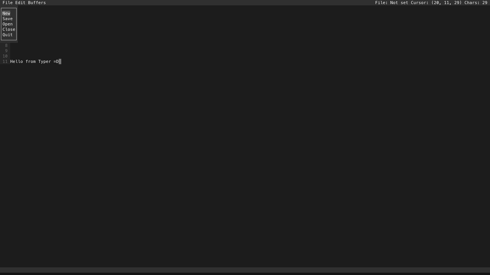
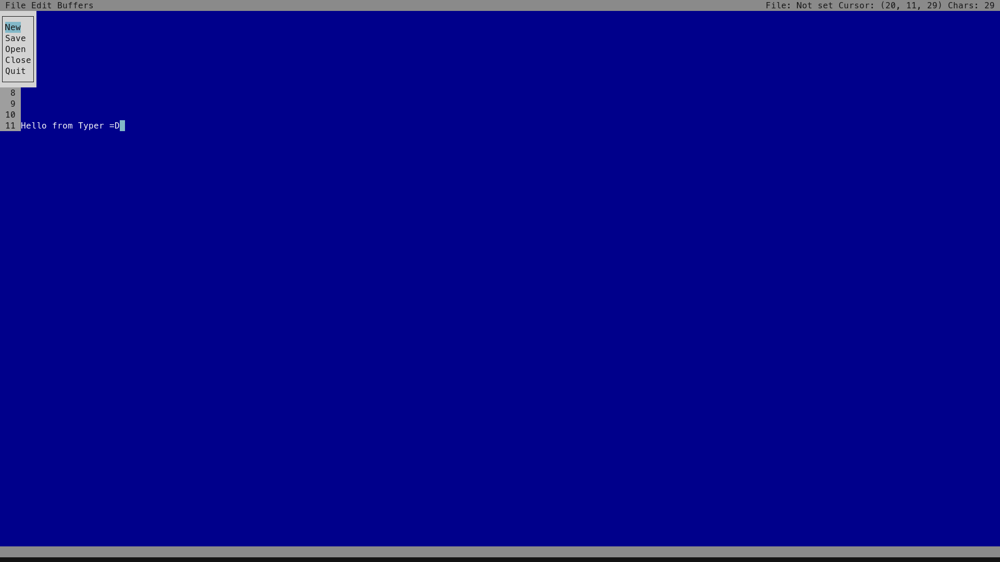

# Typer Text Editor
### A simple and easy to use text editor written in Go

|                          Default Style                           |                          Classic Style                           |
|:----------------------------------------------------------------:|:----------------------------------------------------------------:|
|  |  |

### Installation
#### From a package manager:
|      Distribution      | Package name         |
|:----------------------:|:---------------------|
| Arch Linux/Artix Linux | `typer` from the AUR |
#### From source:
- Download `go` from your package manager or from the go website
- Downlaod `which` from your package manager
- Download `make` from your package manager
- Run the following command to compile Typer
```shell
make
```
- Run the following command **with superuser privileges** to install Typer to your system
```shell
make install SYSCONFDIR=/etc
```